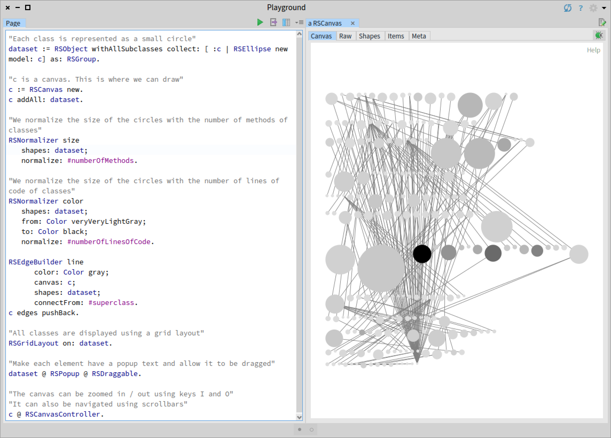
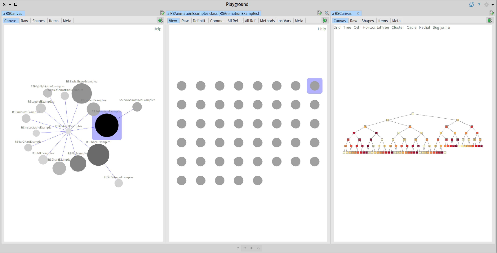

# Tutorial - Roassal3 - Software Visualization

## How to Install
In this tutorial you will learn how to use Roassal3 to build software visualizations. Roassal3 is already included in Pharo 9. However, please install the full version of it (see below). 


Otherwise you can use Pharo 8. You can install Roassal3 by executing the following code snippet in a Playground.

```Smalltalk
Metacello new
    baseline: 'Roassal3';
    repository: 'github://ObjectProfile/Roassal3:v0.9.5';
    load.
```
## Hands-on Session
1. In our first task, we have to create circles to represent the elements in the dataset. Then, we add the circles to the canvas, set a layout, and define simple interactions.

```Smalltalk
"Each class is represented as a small circle"
dataset := RSObject withAllSubclasses collect: [ :c | RSEllipse new size: 5; color: Color gray ].

"c is a canvas. This is where we can draw"
c := RSCanvas new.
c addAll: dataset.

"All classes are displayed using a grid layout"
RSGridLayout on: dataset.

"The canvas can be zoomed in / out using keys I and O"
"It can also be navigated using scrollbars"
c @ RSCanvasController.
```

This will produce the following output.


2. Then, we can use a normalizer to map software metrics to the size and color of the circles. We also add interactions to select elements and obtain contextual information. 
```Smalltalk
"Each class is represented as a small circle"
dataset := RSObject withAllSubclasses collect: [ :c | RSEllipse new model: c ] as: RSGroup.

"c is a canvas. This is where we can draw"
c := RSCanvas new.
c addAll: dataset.

"We normalize the size of the circles with the number of methods of classes"
RSNormalizer size
	shapes: dataset;
	normalize: #numberOfMethods.

"We normalize the size of the circles with the number of lines of code of classes"
RSNormalizer color
	shapes: dataset;
	from: Color veryVeryLightGray;
	to: Color black;
	normalize: #numberOfLinesOfCode.

"All classes are displayed using a grid layout"
RSGridLayout on: dataset.

"Make each element have a popup text and allow it to be dragged"
dataset @ RSPopup @ RSDraggable.

"The canvas can be zoomed in / out using keys I and O"
"It can also be navigated using scrollbars"
c @ RSCanvasController.
```


3. Now we add edges to identify class hierarchies.
```Smalltalk
"Each class is represented as a small circle"
dataset := RSObject withAllSubclasses collect: [ :c | RSEllipse new model: c] as: RSGroup.

"c is a canvas. This is where we can draw"
c := RSCanvas new.
c addAll: dataset.

"We normalize the size of the circles with the number of methods of classes"
RSNormalizer size
	shapes: dataset;
	normalize: #numberOfMethods.

"We normalize the size of the circles with the number of lines of code of classes"
RSNormalizer color
	shapes: dataset;
	from: Color veryVeryLightGray;
	to: Color black;
	normalize: #numberOfLinesOfCode.

RSEdgeBuilder line
		color: Color gray;
		canvas: c;
		shapes: dataset;
		connectFrom: #superclass.
c edges pushBack.
		
"All classes are displayed using a grid layout"
RSGridLayout on: dataset.

"Make each element have a popup text and allow it to be dragged"
dataset @ RSPopup @ RSDraggable.

"The canvas can be zoomed in / out using keys I and O"
"It can also be navigated using scrollbars"
c @ RSCanvasController.
```


4. We now apply a more suitable layout, improve the edges, and limit the size of nodes.
```Smalltalk
"Each class is represented as a small circle"
dataset := RSObject withAllSubclasses collect: [ :c | RSEllipse new model: c] as: RSGroup.

"c is a canvas. This is where we can draw"
c := RSCanvas new.
c addAll: dataset.

"We normalize the size of the circles with the number of methods of classes"
RSNormalizer size
	shapes: dataset;
	to: 20;
	normalize: #numberOfMethods.

"We normalize the size of the circles with the number of lines of code of classes"
RSNormalizer color
	shapes: dataset;
	from: Color veryVeryLightGray;
	to: Color black;
	normalize: #numberOfLinesOfCode.

RSEdgeBuilder line
		color: Color blue;
		canvas: c;
		shapes: dataset;
		width: 0.1;
		connectFrom: #superclass.
c edges pushBack.
		
"All classes are displayed using a grid layout"
RSForceBasedLayout new charge: -70; on: dataset.

"Make each element have a popup text and allow it to be dragged"
dataset @ RSPopup @ RSDraggable.

"The canvas can be zoomed in / out using keys I and O"
"It can also be navigated using scrollbars"
c @ RSCanvasController.
```


5. We now only include in the visualization classes that contain examples.
```Smalltalk
"Each class is represented as a small circle"
dataset := (RSObject withAllSubclasses select: [ :c | ('*Example*' match: c name)]) collect:[:c| RSEllipse new model: c] as: RSGroup.

"c is a canvas. This is where we can draw"
c := RSCanvas new.
c addAll: dataset.

"We normalize the size of the circles with the number of methods of classes"
RSNormalizer size
	shapes: dataset;
	to: 20;
	normalize: #numberOfMethods.

"We normalize the size of the circles with the number of lines of code of classes"
RSNormalizer color
	shapes: dataset;
	from: Color veryVeryLightGray;
	to: Color black;
	normalize: #numberOfLinesOfCode.

RSEdgeBuilder line
		color: Color blue;
		canvas: c;
		shapes: dataset;
		width: 0.1;
		connectFrom: #superclass.
c edges pushBack.
		
"All classes are displayed using a grid layout"
RSForceBasedLayout new charge: -70; on: dataset.

"Make each element have a popup text and allow it to be dragged"
dataset @ RSPopup @ RSDraggable @ (RSLabeled new fontSize: 2) .

"The canvas can be zoomed in / out using keys I and O"
"It can also be navigated using scrollbars"
c @ RSCanvasController.
```


6. Finally, we create a browser of visualization examples. We add the method `RSAbstractExamples>>gtInspectorViewIn`.
```Smalltalk
gtInspectorViewIn: composite

	<gtInspectorPresentationOrder: -10>
	composite roassal3
		title: 'View';
		initializeCanvas: [ 
			| c dataset |
			"Each class is represented as a small circle"
			dataset := self methods collect: [ :m | 
					           RSEllipse new
						           size: 5;
						           model: (m pragmas first methodClass new perform:
									            m pragmas first methodSelector) ].

			"c is a canvas. This is where we can draw"
			c := RSCanvas new.
			c addAll: dataset.

			"All classes are displayed using a grid layout"
			RSGridLayout on: dataset.

			"The canvas can be zoomed in / out using keys I and O"
			"It can also be navigated using scrollbars"
			c @ RSCanvasController.
			c ]
```


## Resources
* [https://github.com/ObjectProfile/Roassal3Documentation]
* [https://github.com/ObjectProfile/Roassal3/wiki]

Leonel Merino
[http://leonelmerino.github.io/]
21-Oct-2020
